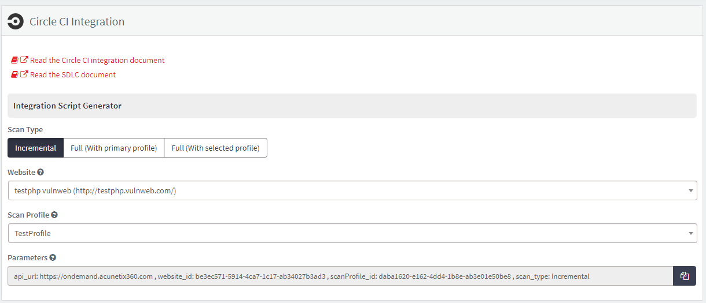

# Acunetix 360 Security Scan [](https://circleci.com/gh/acunetix360dev/Acunetix-360-CircleCI-Orb/tree/master) [](https://discuss.circleci.com/c/ecosystem/orbs)

This orb uses Acunetix 360 to scan your web application for security vulnerabilities. It enables security testing in your CircleCI pipeline.

## What is CircleCI?

[CircleCI](https://circleci.com) is a leading continuous integration tool that allows building, testing,and deploying applications.
Orbs allow CircleCI to be extended with additional functionality. 
In this particular case, this orb integrates Acunetix 360 with CircleCI enabling security testing of your applications.

You can learn more about Orbs [here](https://circleci.com/docs/2.0/using-orbs/).

## What is Acunetix 360?

[Acunetix 360](https://www.acunetix.com/) is an easy to use yet advanced web security solution that can easily scale up and automatically find vulnerabilities in hundreds and thousands of web applications and web services within a matter of hours. It can also be easily integrated within your secure SDLC.

 * Accurate Reports with Proof-Based Scanning™
 * Scan All Your Web Assets
 * Advanced Scanning & Crawling Technology
 * Identify the Most Complex Vulnerabilities
 * Practical Vulnerability Details
 * Include All the Team to Boost Security
 * Automate Vulnerability Triage & Management
 * Integration in the SDLC, DevOps & Other Environments
 * Built-In Tools for Advanced Assessments
 * Reports - all data at your fingertips
 
# Usage

Example `config.yml`:

```yaml
version: 2.1

orbs:
  acunetix360: acunetix-360/acunetix-360@1.1.2

workflows:
  scan-workflow:
    jobs:
      - acunetix360/scan:
          website_id: ${WEBSITE_ID}
          api_url: ${API_URL}
          # If scan_type is "FullWithPrimaryProfile", you do not need to fill in scanProfile_id.
          scanProfile_id: ${SCANPROFILE_ID}
          scan_type: ${SCAN_TYPE}
```

For more detailed usage for this Orb, please check [here](https://circleci.com/orbs/registry/orb/acunetix-360/acunetix-360).

# Help

## Acunetix 360 API Settings

Before using the plug-in, you need the API Key of a user with "Start Scan" privileges to start scanning with Acunetix 360. 

1. Log in to Acunetix 360. 

        
      
2. Select [Your Name] (top right of window), then API Settings. The API Settings window is displayed.

      
  
3. In the **Current Password** field, enter your current password.

4. Click **Submit**.

5. Your User ID and Token are displayed.

6. Then add these values to your project as shown [here](https://circleci.com/blog/new-on-circleci-import-project-environment-variables/).

7. for more information [click](https://www.acunetix.com/support/docs/a360/account/api-settings/)

## Other areas required for CircleCI integration

In order to access other information (eg website_id, scan_type) required in ".yaml" file;
1. Log in to Acunetix 360.
1. Click "Integrations> New Integration" from the menu on the left. From the page that opens, click CircleCI under the "Continuous Integration Systems" tab.
1. Please select the type you want to scan. (Incremental, Full With primary profile, Full With selected profile). ApiUrl, WebsiteId, ScanType and ProfileId will be provided to you according to your choice. You can add values without quotation marks, as shown in the usage area.


